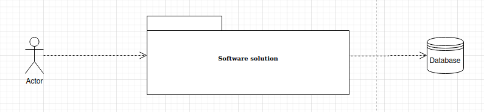
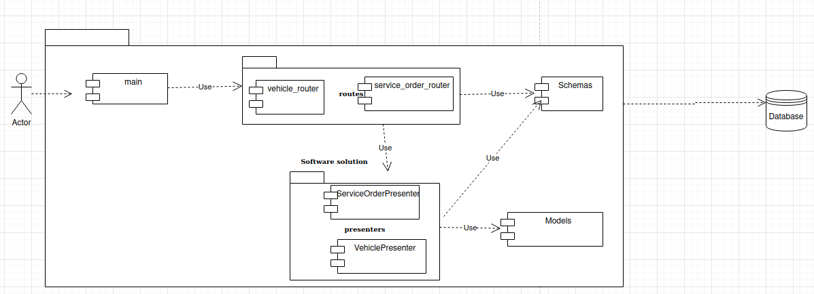

# Transportista Backend

Este proyecto es un backend para una empresa transportista, diseñado para administrar los procesos asociados al mantenimiento de sus vehículos. La aplicación está construida utilizando FastAPI y SQLAlchemy, y proporciona una API para registrar vehículos y gestionar órdenes de servicio de mantenimiento.

## Características

- **Registro de vehículos:** Permite registrar nuevos vehículos en el sistema.
- **Gestión de órdenes de servicio:** Permite crear y gestionar órdenes de servicio de mantenimiento para los vehículos registrados.

## Casos de uso del proyecto

[Puede leer la descripción de los casos de uso del proyecto en el siguiente enlace](https://docs.google.com/document/d/1rc_qwah9lSTGPdX6mdccUc8dwKAVXa7yAI17hzhXfYY/edit?hl=es)


## Requisitos

- Python 3.10 o superior
- FastAPI
- Uvicorn
- SQLAlchemy
- Alembic
- Pydantic

## Estructura básica del proyecto

```sh
transportista_backend/
├── app/
│   ├── __init__.py
│   ├── main.py
│   ├── models.py
│   ├── schemas.py
│   ├── database.py
│   ├── routers/
│   │   ├── __init__.py
│   │   ├── vehicles.py
│   │   ├── service_orders.py
│   ├── presenters/
│   │   ├── __init__.py
│   │   ├── vehicle_presenter.py
│   │   ├── service_order_presenter.py
│   ├── views/
│   │   ├── __init__.py
│   │   ├── vehicle_view.py
│   │   ├── service_order_view.py
├── tests/
│   ├── test_integration.py
├── requirements.txt
```

## Arquitectura de la solución
Vista de general de la solución


Vista de componenentes de la solución


## Instalación

1. Clona el repositorio:

    ```sh
    git clone https://github.com/tu_usuario/transportista_backend.git
    cd transportista_backend
    ```

2. Crea y activa un entorno virtual:

    ```sh
    python -m venv env
    source env/bin/activate  # En Windows usa `env\Scripts\activate`
    ```

3. Instala las dependencias:

    ```sh
    pip install -r requirements.txt
    ```

4. Configura la base de datos:

    - Edita `database.py` para configurar la URL de tu base de datos.
    - Realiza las migraciones iniciales:

    ```sh
    alembic upgrade head
    ```

## Ejecución

Para ejecutar el servidor de desarrollo, usa el siguiente comando:

```sh
uvicorn app.main:app --reload
```

## Utilizando Docker
1. Construir la imagen Docker:
```sh
docker build -t nombre-de-tu-imagen .
```

2. Ejecutar el contenedor:
```sh
docker run -d -p 8000:8000 nombre-de-tu-imagen
```

## Utilizando Docker Compose

1. Construir y ejecutar los contenedores con Docker Compose:
```sh
docker-compose up --build
```